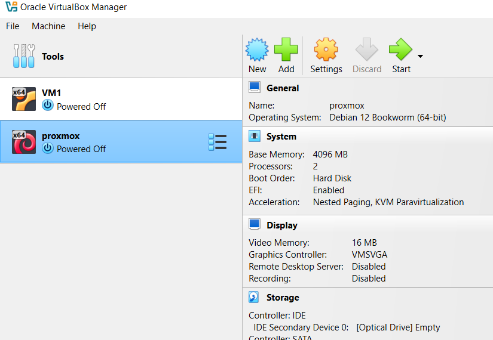
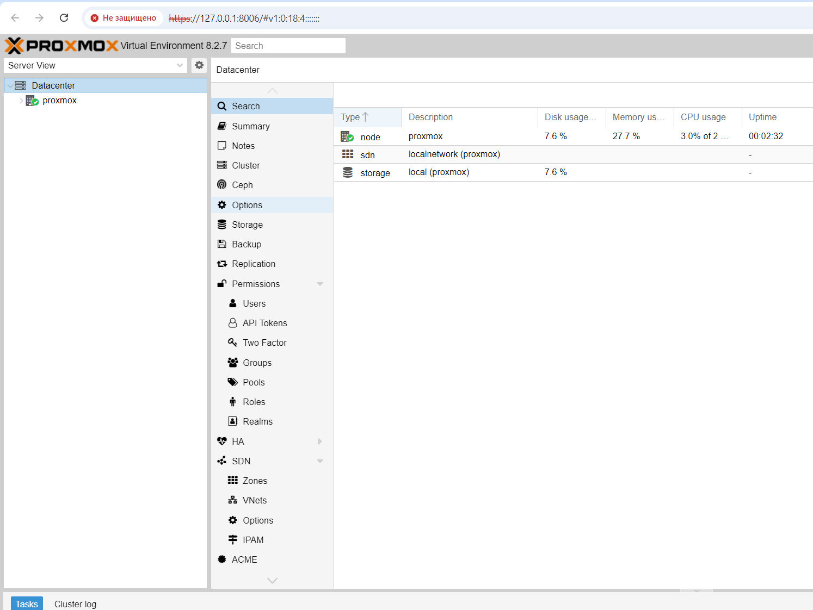

# Лабораторная работа №1 

## Цель работы:
Установить proxmox

## Выполнение работы

### 1. Установка и настройка виртуальной машины

#### 1.1 Подготовка
- Скачиваем VirtalBox [тут](https://www.virtualbox.org/wiki/Downloads), устанавливаем.
- Скачиваем предоставленный преподователем архив с образом виртуальной машиной, разархивируем.

#### 1.2 Добавляем вирутальную 
Добавляем вирутальную машину, нажав на зелёный плюсик вверху (или Ctrl-A).
Идём туда, куда распаковали архив, ищем там файл `debian-12.vbox`, выбираем его.
Видим новую добавленную вируталочку `debian-12`.
Переименуем её в настройках в `proxmox`.



#### 1.3 Прикрепляем к VM диск

В меню `Tools` идём во вкладу `Media`. Там видим жёсткий диск `debian-12.vdi`, помеченный восклицательным знаком, удаляем его.


Вместо удалённого импортируем диск с таким же названием из распакованного архива.


После этого идём в настройский VM в раздел `Storage` и добавлем этот диск в `Controller:SATA`.


#### 1.4 Запускаем VM 

Делается это двойным кликом или кнопкой `Start`.

#### 1.5 Пробрасываем порты

Идём в `Settings -> Network` и жмём на `Port Forwarding`. 


Добавляем проброс для SSH:
- адрес хоста: 127.0.0.1
- порт: 2222
- адрес гостя(vm): 10.0.2.15 (по умолчанию)
- порт гостя: 22

Добавляем проброс для Proxmox:
- адрес хоста: 127.0.0.1
- порт: 8006
- адрес гостя(vm): 10.0.2.15 (по умолчанию)
- порт гостя: 8006


### 2. Установка proxmox

#### 2.1 Подключаем к VM по SSH

Идём и скачиваем SSH-клиент для Windows [Putty](https://www.putty.org/), после чего устанавливаем и запускаем.
В `Host Name` вводим `127.0.0.1`, в `Port` - `2222`.


Логинимся под рутом:


#### 2.2 Подготовка к установке Proxmox

Добавляем необходимые для установки репозитории:

```
echo "deb [arch=amd64] http://download.proxmox.com/debian/pve bookworm pve-no-subscription" > /etc/apt/sources.list.d/pve-install-repo.list
```

А так же добавляем цифровую подпись:

```
wget https://enterprise.proxmox.com/debian/proxmox-release-bookworm.gpg -O /etc/apt/trusted.gpg.d/proxmox-release-bookworm.gpg
```


Обновляем запись в /etc/hosts, чтобы по хостнейму proxmox возвращался валидный IP-адрес (в нашем случае, внутренний адрес ВМ):


#### 2.3 Непосредственно установка

Обновляем репозитории, устанавливаем Proxmox. Пришлось подождать, пока всё загрузилось.

```
apt update && apt install ifupdown2 proxmox-ve open-iscsi
```


#### 2.4 Проверка успешности установки

Ребутаем VM. Если после ребута появилось новое приветственное сообщение, значит Proxmox успешно установился и загрузился с нового ядра.


Проверяем работу с хоста из браузера. Для этого вводим адрес `https://127.0.0.1:8006`. Видим веб-морду proxmax'a. Логинимся и радуемся.




### 3. Итоги

В результате выполнения работы мы научились устанавливать proxmox и даже не поседели при этом.