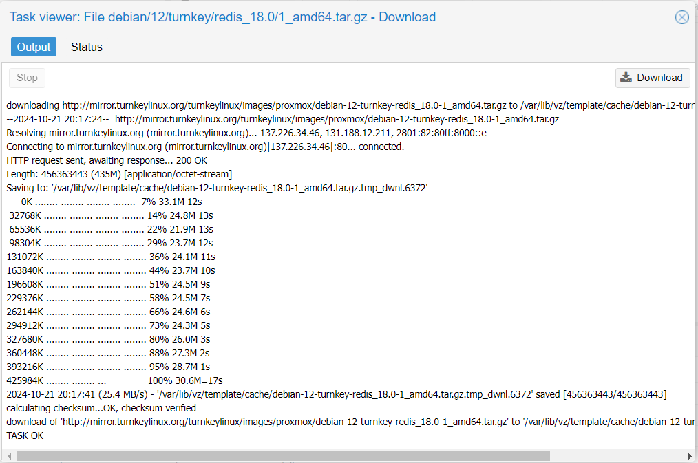

# Лабораторная работа №2: Знакомство с LXC-контейнерами

## Цель работы:
Поднять контейнеры с помощью Proxmox.

## Выполнение работы

### 1. Настройка сетевого интерфейса.

#### 1.1 Подготовка
Необходимо запустить виртуальную машину с proxmox, настроенную в лабораторной работе №1.

#### 1.2 Создание нового сетевого интерфейса
Кликаем на ноду proxmox, переходим в раздел `System -> Network`.
Сейчас там присутствует лишь сетевой интерфейс по умолчанию, он же основной сетевой интерфейс ранее созданной виртуальной машины: `enp3s0`.


Т.к. для создания ВМ и контейнеров в Proxmox необходимо использовать сетевой интерфейс типа bridge, то существующий интерфейс нам не подойдет.
Создаём новый, нажав Create -> Linux Bridge.

Указываем:
- IP-адрес - `10.0.2.15/24`
- В качестве шлюза - `10.0.2.2` 
- В качестве порта бриджа - имя сетевого интерфейса по умолчанию: `enp3s0`.


После этого нажимаем кнопку `Apply configuration`.


Проверяем, что всё хорошо.
Для этого логинимся на ВМ и выполняем команду `ip a`:


### 2. Установка контейра с Redis

#### 2.1. Скачиваем образ контейнера
Для создания контейнера необходим его базовый образ.
В Proxmox это называется template (шаблон).
Проваливаемся внутрь ноды proxmox и выбираем пункт меню `CT Templates`


Кликаем по кнопке `Templates` и через поиск находим нужный темплейт с redis, затем нажимаем `Download`.




#### 2.2. Создаём контейтер с Redis
В правом верхнем углу нажимаем на кнопку `Create CT`.
Все настройки оставляем по умолчанию, кроме `IPv4` в разделе `Network` – там выбираем DHCP.
В качестве темплейта, выбираем только что скачанный reddis.


Видим, что `TASK OK`, значит все создалось успешно.

#### 2.3. Инициализируем контейтер с Redis
Для первоначальной инициализации кликаем на свежесозданный контейнер в меню слева и выбрать пункт `Console`.
Логин – root, пароль - тот, что указали на первой вкладке при создании контейнера.


На самом первом шаге инициализации надо придумать пароль для будущей админки Redis. 
Интерфейс для подключения выбираем `all`. `Protected-mode` выключаем. 
Все остальное - жмём на `skip`.


Последний экран прихраняем: на нем перечислены адреса и порты доступов до redis.
На этом этапе настройка завершена, готовым контейнером с redis можно пользоваться по назначению (выход через пункт Quit).


### 3. Установка и настройка контейра с NextCloud

#### 3.1. Скачиваем образ контейнера
Делаем по аналогии с пунктом `2.1`, только для nextcloud. 


#### 3.2. Создаём контейнер с помощью коммандной строки
Для этого логинимся на ВМ с proxmox и выполняем следующую команду:

```
pvesh create /nodes/proxmox/lxc -vmid 101 -hostname nextcloud -unprivileged true -storage local -password "qwerty123" -net0 "name=eth0,bridge=vmbr0,ip=dhcp,firewall=yes" -ostemplate local:vztmpl/debian-12-turnkey-nextcloud_18.1-1_amd64.tar.gz -memory 512
```


Возвращаемся в веб-интерфейс, проверяем, что новый контейнер успешно создался:


#### 3.3. Инициализируем контейтер с NextCloud
Делаем аналогично с пунктом `2.3`.
На моменте с Redis получаем ошибку – ожидаемо, мы настроим подключение к нему позже, пока что выбираем Skip. 
В качестве Nextcloud Domain указываем localhost.


#### 3.4. Пробрасываем порты для NextCloud
В VirtualBox идём в `Settings -> Network` и жмём на `Port Forwarding`. 

Добавляем проброс для nextcloud:
- адрес хоста: `127.0.0.1`
- порт: `443`
- адрес гостя(vm): `10.0.2.17`
- порт гостя: `443`


Проверяем работу в браузере по адресу https://localhost/ - видим ошибку сервиса, т.к. некстклауд не смог найти редис.


#### 3.5. Настраиваем конфиг NextCloud
Возвращаемся в консоль некстклауда, открываем файл `/var/www/nextcloud/config/config.php` и заменяем адрес редиса на `ip/port` из шага `2.3`.
Также отключаем `Memcache`, удалив целиком строчку с `memcache.local`.


Возвращаемся в браузер и убеждаемся, что теперь форма входа в Nextcloud открывается без ошибок:


### 4. Ответы на вопросы:
**Вопрос 1**: Почему неправильная конфигурация на шаге 1.2 приведет (вероятнее всего) к полной потере сетевой доступности?

Ответ: потому новый интерфейс станет основым, и при его неправильной конфигурации ВМ не сможет подключиться к маршрутизатору. 
Таким образом выпадет из сетевого окружения. А поскольку это ВМ, а не физическая машина, то исправить данную печальную ситуацию мы уже не сможем.

**Вопрос 2**: Почему адрес шлюза (default gateway) виртуальной машины выглядит как 10.0.2.2, а не 10.0.2.1?

Ответ: подозреваю, потому что 10.0.2.1 кем-то занят :) Например, шлюзом другой сетки.


### 5. Итоги
В результате выполнения работы мы научились создавать и настраивать контейнеры как из веб-интерфейса, так и с помощью командной строки.
