# Лабораторная работа №3: Знакомство с объектным хранилищем в Proxmox

## Цель работы:
Установить и настроить объектное хранилище Ceph для работы с Proxmox.

## Выполнение работы

### 1. Подготовка.
Необходимо запустить виртуальную машину с proxmox, настроенную в лабораторной работе №2.\
Для установки и настройки Ceph, нам необходимо иметь дополнительные диски, которые не используются самим Proxmox.
Поэтому создадим и подключим к нашей виртуалке два диска. В Virtualbox выбираем пункт `Настроить → Носители → Контроллеры SATA → Добавить Жесткий диск → Создать`.\
Зададим следующие параметры:
- Формат: VHD
- Объем: 5 Гб
- Имя: называем ceph_1 и ceph_2

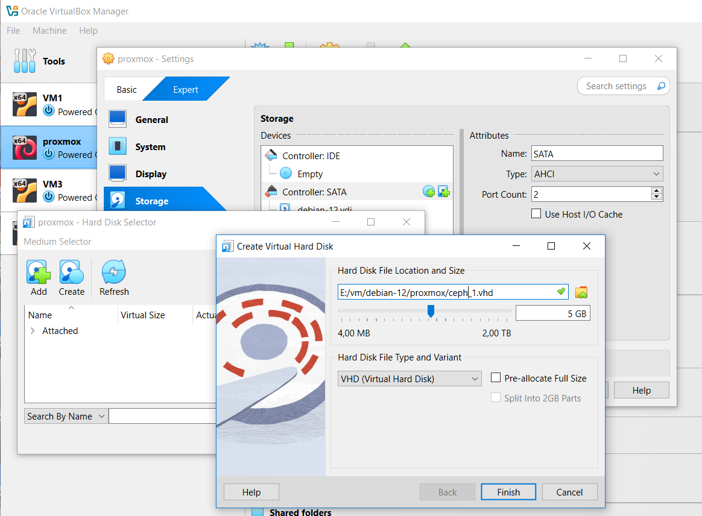

После создания обоих дисков, добавим их в том же окне:

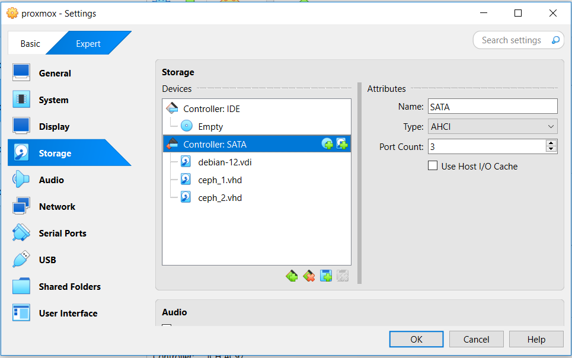

Далее заходим в веб-интерфейс проксмокса и убеждаемся, что он увидел наши новые диски. Для этого на уровне ноды выбираем пункт меню `Disks`, и видим там наших красавцев: `/dev/sdb` и `/dev/sdc`

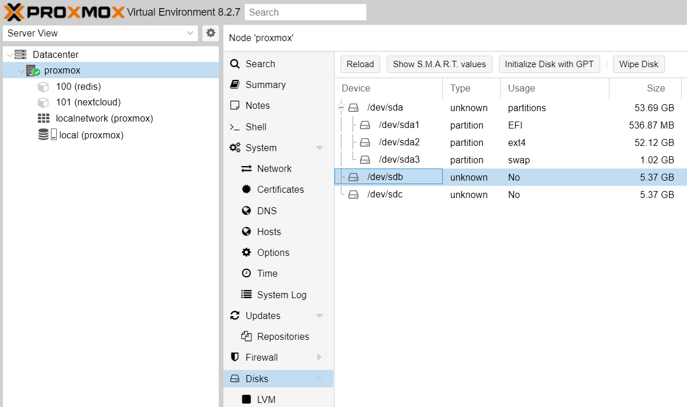

### 2. Установка Ceph
На уровне ноды выбираем пункт меню `Ceph`. Поскольку у нас его еще нет, проксмокс предложит установить.
Устанавливаем, выбирая в качестве репозитория `No-subsription`, а во вкладке Configuration выбираем нашу сеть:

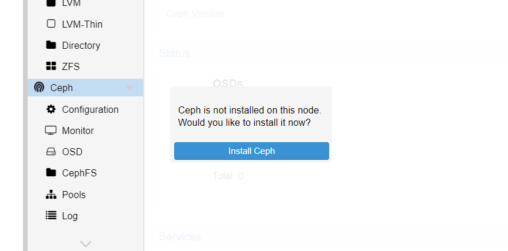

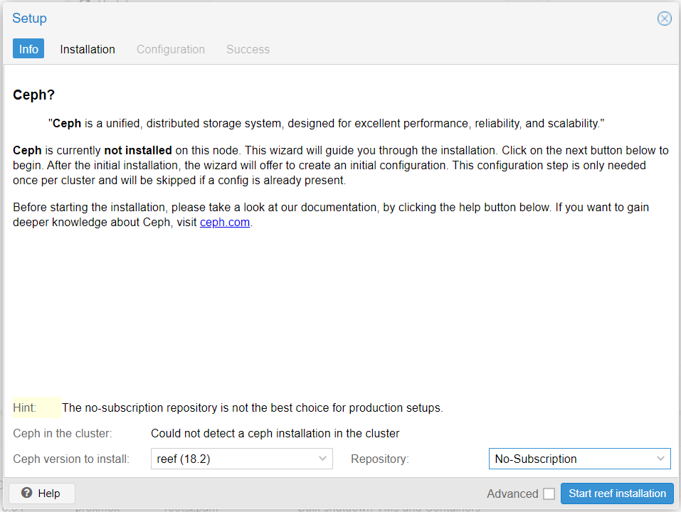

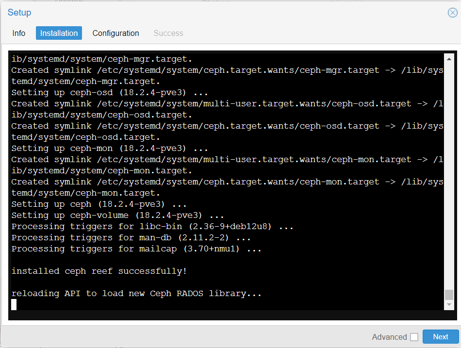

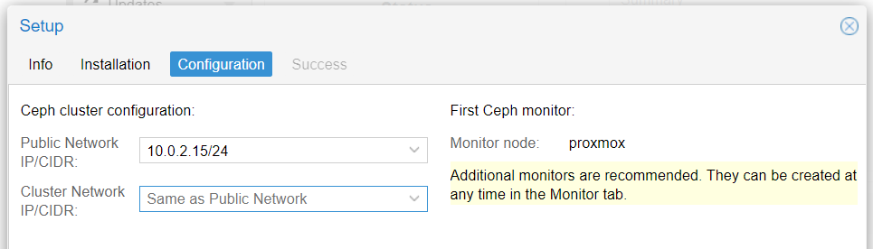

В результате должны увидеть следующее: 

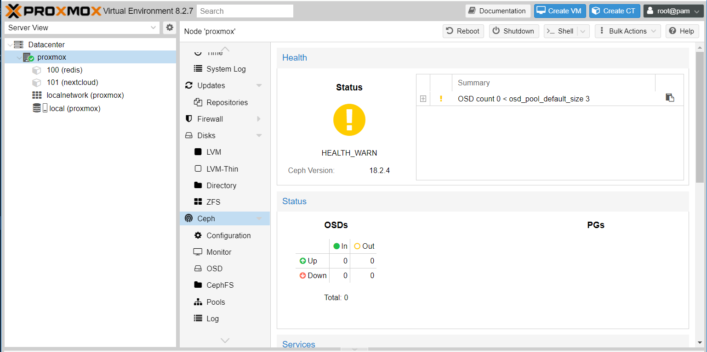

Жёлтый цвет у нас из-за того, что в Ceph не добавлен ни один диск. Исправим это.

### 3. Добавление дисков в Ceph и создание пула
В разделе `Ceph` заходим в пункт `OSD` и добавляем наши два диска в кластер, через кнопку `Create OSD`, оставляя все параметры по умолчанию. Жмём `Reload` и видим два новых OSD диска в состоянии `up`: 

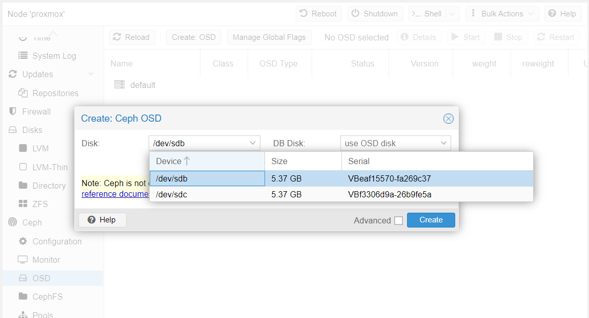

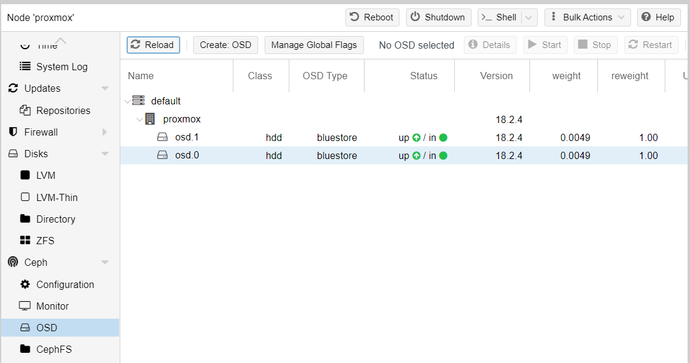

Далее создаем дисковый пул в разделе `Pools`. Имя пусть будет `testPool`, размер 7 GB:

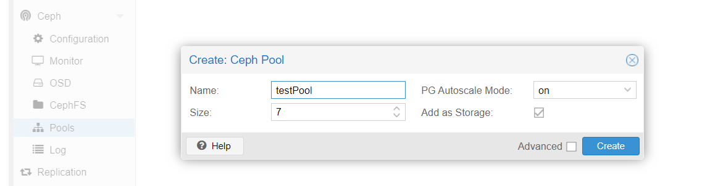

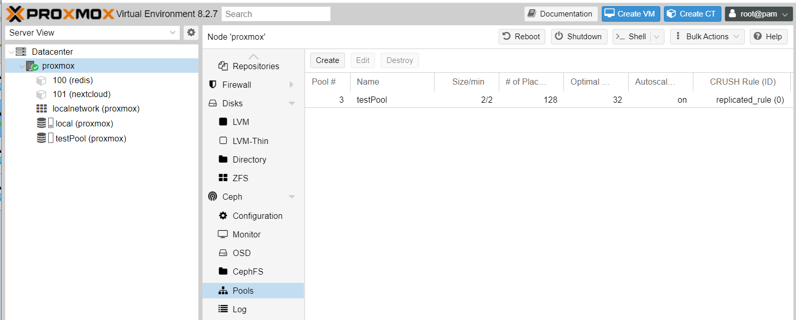
 
Теперь этот пул можно использовать в качестве источника хранения при создании ВМ или контейнеров.

### 4. Создадие контейнера с использованием пула

В правом верхнем углу нажимаем на кнопку `Create CT`.\
Для того, что использовать созданный ранее пул, выбираем его в качестве `Storage` на вкладка `Disks`

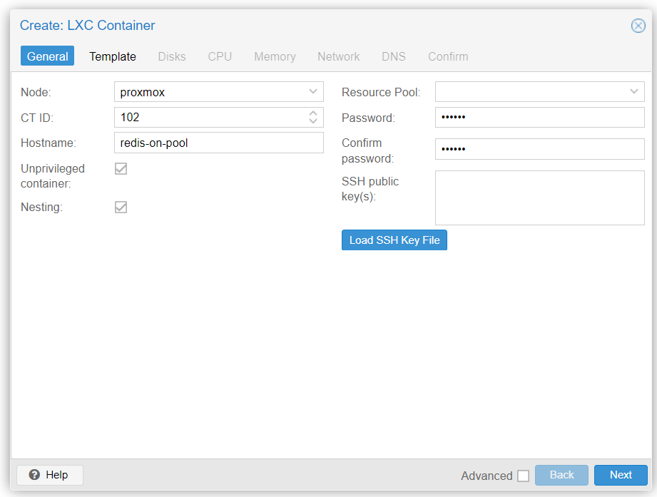

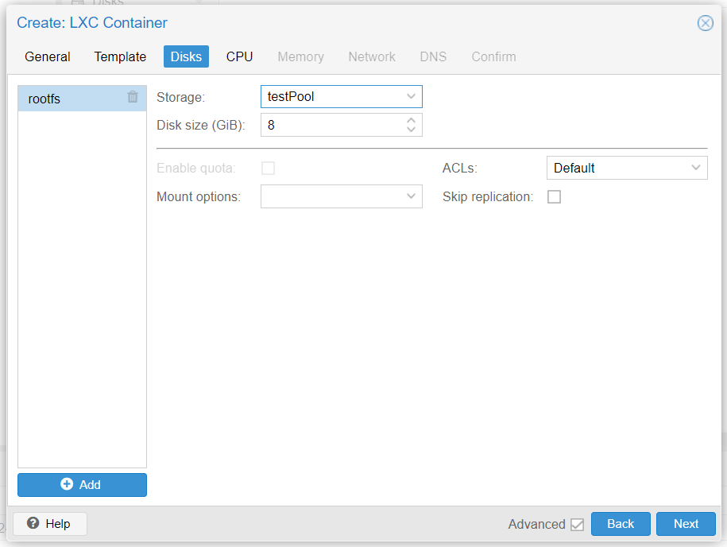

В результате получим контейнер, установленный на дисковый пул.

### 4. Ответ на вопрос:
**Вопрос**: Чем объектное хранилище отличается от обычного?\

Ответ: В объектном хранилище данные хранятся в виде объектов. Объект состоит из фактических данных, таких как документы, изображения или значения данных, и связанных с ними метаданных.\
Метаданные – это дополнительная информация об объекте, которую можно использовать для ее получения.\
Метаданные могут включать такие атрибуты, как уникальный идентификатор, имя объекта, размер, дата создания и пользовательские теги.
Так же в системах хранения объектов  используется плоское пространство имен, поэтому объекты хранятся без необходимости в иерархической структуре.\
Вместо этого уникальный идентификатор объекта предоставляет адрес объекта в системе хранения.\
Идентификатор генерируется из содержимого объекта с помошью алгоритма хеширования, что гарантирует, что объекты с одинаковым содержимым имеют один и тот же идентификатор.\
Кроме того, такой тип хранилища предоставляет практически неограниченное дисковое пространство.

### 5. Итоги
В результате выполнения работы мы научились создавать объектное хранилище.
